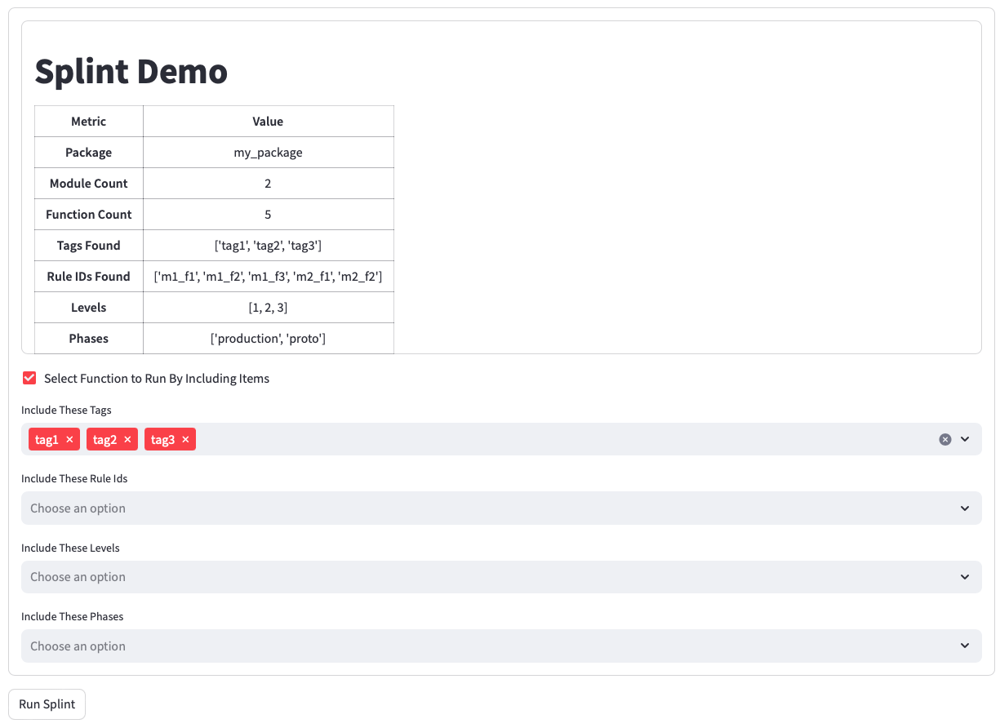
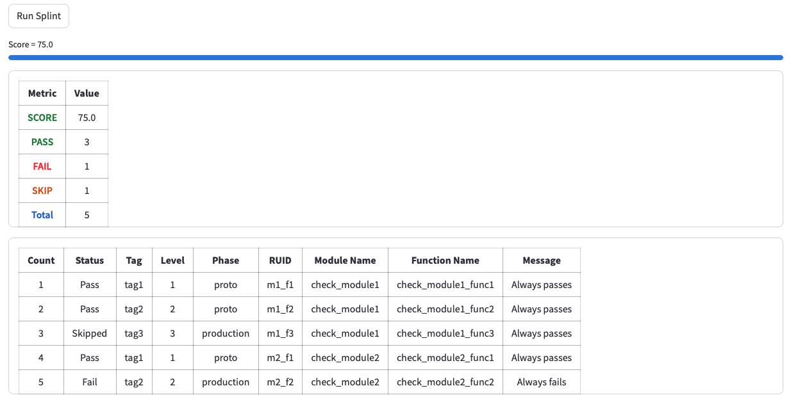

# Splint: A Linting Framework

Splint empowers you to create a linting tool for any task by utilizing a declarative style similar to `pytest`.
With just a few lines of code, you can define rules that integrate into your workflow by providing JSON
output natively. Connecting to FastAPI or Streamlit is straight forward.

## Overview

Splint transcends traditional code analysis, offering a solution for a wide range of tasks. Inspired by the
effectiveness
of `pylint` in identifying and resolving code issues, I envisioned a tool capable of extending this functionality
across diverse workflows with minimal setup. Splint allows for easy `linting` of any aspect of a project or
system, providing access to detailed test results for integration with JSON friendly tools like Streamlit
and FastAPI.

The intention is NOT to be a `linter` by parsing the syntax of a programming language, it is meant to be a `linter`
in the sense that some system has a large set of rules that must be met for the system to be in a good state.  The
more rules the system adheres to the 'better' it is.

After experimenting with various approaches, including straight application scripting and the extensive
configuration files, I found that a `pytest`-like framework could offer the flexibility and ease of use 
I sought. While `pytest` serves a different purpose, its declarative style for writing independent tests, 
managed by the framework, inspired the development of Splint.

Splint facilitates running a set of rules against a system, delivering detailed results and a "score" for
the run. Achieving a 100% score indicates all tests passed, accompanied by a comprehensive list of pass/fail status.
In case of failures, Splint provides detailed information about the issues encountered, along with a score less
than 100%.

Splint follows a structure familiar to users of `pytest`, defining rules in files as Python functions that seamlessly
integrate with your application. With minimal boilerplate and automatic detection, writing rule-checking Python code
becomes straightforward. The autoloaded modules and rule functions support parameters, akin to `pytest`, dynamically
built from the system's environment.

While the concept may sound intricate, understanding Splint is straightforward for those familiar with `pytest`.
Its principles have proven effective in environments where end users may not be programmers, offering a clear path to
identify and correct issues to ensure system compliance. By adhering to agreed-upon rule sets, teams can work
harmoniously, driving error counts to zero.

## Why Not pytest, Great Expectations or other popular tools?

The distinction between Splint, `pytest`, and Great Expectations and others lies in their scope, complexity, and 
target audience. 

### pytest:

- **Scope**: Primarily focused on code testing within the Python ecosystem.
- **Complexity**: Comprehensive and feature-rich, tailored for developers and integrated into IDEs.
- **Audience**: Consumed by developers, requiring a code-first approach.
- **Visibility**: Limited to `assert True, msg='...'` while most messages are meant to be hidden.

### Great Expectations (ge):

- **Scope**: Centered around data validation and expectation testing in data pipelines and notebooks.
- **Complexity**: Robust and feature-rich, catering to data scientists and integrated into data pipelines.
- **Audience**: Consumed by data scientists, emphasizing a data-first approach.
- **Visibility** Very good view of data integrity at the rule level.

### Tableaux/PowerBI

- **Scope** Centered around graphical output of charts, graphs, and status for corporate dash-boarding.
- **Complexity** Robust and feature rich catering to real time charting with complex graphical displays.
- **Audience** Consumed by everyone in an organization created as mostly in a low-code environment.
- **Visibility** Beautiful charting.  For our application this is eye candy.

### Splint:

- **Scope**: Offers comprehensive linting and testing capabilities for any task or system focused on granular pass fail
  tests.
- **Complexity**: Lightweight and straightforward, designed for end users with detailed testing results and scoring.
- **Audience**: Consumed by end users across various domains, facilitating rule-based testing with clear insights into
  testing results. A typical go/no-go test has 100's of tests that are run almost exclusively as pass/fail
- **Visibility**: Concise list of passing and failing rules with extensive detail and filtering capabilities for infrastructure,
                  data integrity, project management and general system status.

## Getting Started with Splint

If you're familiar with `pytest`, getting started with `splint` is a breeze. Similar to `pytest`, `splint` allows
you to write independent rules that verify the state of your system. These rules should be atomic and able to run in
any order. If you're accustomed to writing tests with modules starting with "test" and functions beginning with "test",
transitioning to `splint` will feel natural. Additionally, if you understand fixtures, you'll find that the concept is
also available through environments. Every rule can be tagged with various attributes to allow filtering which rules
to run and organization when reporting results.

### Simple Rules

You can start with simple rules that don't even reference `splint` directly:

```python
from junk import get_drive_space

def check_boolean():
    return get_drive_space('/foo') > 1_000_000_000

def check_yielded_values():
    yield get_drive_space('/foo') > 1_000_000_000
    yield get_drive_space('/fum') > 1_000_000_000
```

As you might expect running this will provide 3 passing test results but with very limited feedback.

You can up your game and return status message info:
From the most simple you could write rules like this:

```python
from splint import SplintResult, SR
from junk import get_drive_space


def check_boolean():
    return SplintResult(status=get_drive_space('/foo') > 1_000_000_000, msg="Drive space check for foo")


def check_yielded_values():
    yield SR(status=get_drive_space('/foo') > 1_000_000_000, msg="Drive space check for foo")
    yield SR(status=get_drive_space('/fum') > 1_000_000_000, msg="Drive space check for fum")
```

As you might expect running this will also provide 3 passing test results with better messages.

Now we can add more complexity. Tag check functions with attributes to allow subsets of checks to be run.

```python
from splint import SplintResult, attributes
import datetime as dt
import pathlib


@attributes(tag="file")
def check_file_exists():
    """ Verify this that my_file exists """
    status = pathlib.Path("my_file.csv").exists()
    return SplintResult(status=status, msg="Verify daily CSV file exists")


@attributes(tag="file")
def check_file_age():
    file = pathlib.Path("my_file.csv")
    modification_time = file.stat().st_mtime
    current_time = dt.datetime.now().timestamp()
    file_age_in_seconds = current_time - modification_time
    file_age_in_hours = file_age_in_seconds / 3600
    if file_age_in_hours < 24:
        return SplintResult(status=True, msg="The file age is OK {file_age_in_hours}")
    else:
        return SplintResult(status=False, msg="The file is stale")
```

And even a bit more complexity pass values to these functions using environments, which are similar to `pytest`
fixtures.

```python
import datetime as dt
import pathlib
from splint import attributes, SplintResult


def env_csv_file():
    env = {'csv_file': pathlib.Path("my_file.csv")}
    return env


@attributes(tag="file")
def check_file_exists(csv_file):
    """ Verify this that my_file exists """
    return SplintResult(status=csv_file.exists(), msg="Verify daily CSV file exists")


@attributes(tag="file")
def check_file_age(csv_file):
    modification_time = csv_file.stat().st_mtime
    current_time = dt.datetime.now().timestamp()
    file_age_in_seconds = current_time - modification_time
    file_age_in_hours = file_age_in_seconds / 3600
    if file_age_in_hours < 24:
        return SplintResult(status=True, msg="The file age is OK {file_age_in_hours}")
    else:
        return SplintResult(status=False, msg="The file is stale")
```

## How is Splint Organized?

Splint uses the following hierarchy:

    SplintPackage` (one or more SplintModules in a folder)
        SplintModule` (one or more SplintFunctions in a Python file (function starting with the text "check_"))
            SplintFunction` (when called will return 0 or more `SplintResults`)

Typically one works at the module or package level where you have python files that have 1 or more files with rules in
them.

Each Splint function returns 0-to-N results from its generator function. By convention, if None is returned, the rule
was skipped.
The rule functions that you write don't need to use generators. They can return a variety of output
(e.g., Boolean, List of Boolean, `SplintResult`, List of `SplintResult`), or you can write a generator that yields
results as they are checked.

Alternatively you can ignore the file and folder discovery mechanism provide list of rules as regular python
functions and `Splint` will happily run them for you.

```python
import splint
from rules import rule1,rule2,rule3,rule4,rule5,sql_conn
checker = splint.SplintChecker(check_functions=[rule1, rule2, rule3, rule4, rule5], auto_setup=True)
results = checker.run_all(env={'db': sql_conn, 'cfg': 'cfg.json'})
```

## Rule Integrations

To simplify getting started, there are included rules you can call to check files and folders on your file system
dataframes, Excel spreadsheets, PDF files and web APIs. These integrations make many common checks just a few lines of code.

These generally take the form of you wrapping them in some way to provide the required inputs and any attributes
required by your app as well as messages specific to your application.


The rules shown below trigger errors if there are any log files > 100k in length and if they haven't been updated
in the last 5 minutes.

```python
import splint

@splint.attributes(tag="tag")
def check_rule1():
    for folder in ['folder1','folder2','folder3']:
        yield from splint.rule_large_files(folder=folder, pattern="log*.txt", max_size=100_000)

@splint.attributes(tag="tag")
def check_rule2():
    for folder in ['folder1','folder2','folder3']:
        yield from splint.rule_stale_files(folder=folder, pattern="log*.txt",minutes=5.0)
        
@splint.attributes(tag="tag")
def check_rule3(cfg):
    """cfg: application config file."""
    for folder in cfg['logging']['folders']:
        yield from splint.rule_stale_files(folder=folder, pattern="log*.txt",minutes=5.0)
```

## What is the output?

The low level output of a `SplintFunction` are `SplintResults`. Each `SplintResult` is trivially converted to a `json`
record or a line in a CSV file for processing by other tools. It is easy to connect things up to
`Streamlit`, `FastAPI` or a `typer` CLI app by json-ifying the results. Each test can have a lot of data attached
to it, if needed, but from the end user perspective the `msg` and `status` are often enough.  You will notice that
there are useful elements in the result including the doc string of the rule function, which allows you to provide
documentation for your rules that is exposed all the way up result stack.  For example your doc strings could 
include information useful providing detailed information and greatly simplify displaying metadata in UI elements
like tooltips as well as detailed error information with the traceback and exception data.

```json
{
  "result": {
    "status": true,
    "func_name": "check_result_1_1",
    "pkg_name": "",
    "module_name": "check_1",
    "msg": "Result for test 1.1",
    "info_msg": "",
    "warn_msg": "",
    "doc": "Check result 1.1 docstring",
    "runtime_sec": 0.00027108192443847656,
    "except_": "None",
    "traceback": "",
    "skipped": false,
    "weight": 100,
    "tag": "tag1",
    "level": 1,
    "phase": "prototype",
    "count": 1,
    "ruid": "1_1",
    "ttl_minutes": 0,
    "mit_msg": "",
    "owner_list": []
  }
}
```

## What are scores?

The idea of scoring is simple but the details are complex. Scores let you look at the results of all of your checks
and reduce it to number from 0 to 100. A simple percentage of pass fail results can work...but what if some rules are "
easy" while others are hard? What if some test have 100's of ways to fail (each line in a spreadsheet needs a comment)
but has only one result when there are no failures? It turns out you need weights and ways to aggregate results to
make sense of these things.

Out of the box, most of these cases can be handled by choosing a scoring method. Currently, scoring happens globally,
but it is in work creating scoring by function.

| Scoring              | Description                                                              |
|----------------------|--------------------------------------------------------------------------|
| `by_result`          | Each result from a functon counts as 100%                                |
| `by_function_binary` | All tests from a single function must pass to get 100% for the function. |
| `by_funciton_mean`   | If a function has 3 results and 2 pass the function result is 66%        |
| `binary_fail`        | If any single result from a function is False, the function score is 0%  |
| `binary_pass`        | If any single result from a function is True, the function score is 100% |

IN addition to the scoring, each function has a weight that is also applied to it after the scoring to all
different rules to have higher weights.

The utility of this is somewhat useless in smaller systems (< 100 rules) since we generally are aiming to
have 100% pass.  The weighting could be used to determine triage.

## What are @attributes?

Each rule function can be assigned attributes that define metadata about the rule function. Attributes are at the heart
of how `splint` allows you to filter, sort, select tests to run and view by adding decorators to your check functions.

| Attribute        | Description                                                                                                                         |
|------------------|-------------------------------------------------------------------------------------------------------------------------------------|
| `tag`            | Zero or more strings that can be used for filtering results.                                                                        |
| `phase`          | A single string that indicates a project phase like testing or development.                                                         |
| `level`          | A numeric value that is better for greater than/less than tests.                                                                    |
| `weight`         | A positive number indicating the weight of a functions results. The nominal weight is 100.                                          |
| `skip`           | Indicates the function should be skipped.                                                                                           |
| `ruid`           | Rule-ID is a unique identifier for a rule.                                                                                          |
| `ttl_minutes`    | Allow caching of results so expensive tests don't need to be rerun which is only useful in cases where you run tests over and over. |
| `finish_on_fail` | Aborts processing of `splint` function on the first failure.                                                                        |
| `skip_on_none `  | If an environment parameter has a None value then the function will be skipped.                                                     |
| `fail_on_none`   | If an environment parameter has a None value then the function will be failed.                                                      |

## What are Rule-Ids (RUIDS)?

Tags and phases are generic information that is only present for filtering. The values don't mean much to the inner
workings of splint.  `RUID`s are different. The purpose of a `RUID` is to tag every rule function with a unique value
that is, ideally, meaningful to the user.  For very large rule sets this becomes prohibitive and ends up looking like
integers with some leading text. The only rule to the code is that they are unique. If you tag a single
function with an RUID the system will expect you to put a unique ID on every function, or to set the `auto_ruid` flag 
to True when creating a `SplintChecker` object.  

What do you get for this? You now have fine grain control to the function level AND the user level to enable/disable
checks. A `pylint` analogy is that you can turn off-line width checks globally for you project setting values in
the `.lintrc` file. In the case of `splint`, perhaps part of your system has one set of rules and another part of
the system has the same set but some don't apply.
Or perhaps in an early phase development a subset of rules is applied, and at another a different set of rules is
applied.

RUIDS allow you to set function level granularity with "simple" config files (THAT CURRENTLY DON'T EXIST)

RUIDs can be anything hashable (but come on, they should be short strings). Smart-ish values like File-001, Fill-002, '
smarter' or File-Required, File-Too-Old. Whatever makes sense on the project. As a general rule smart naming conventions
aren't smart, so beware of the bed you make for yourself.

```python
from splint import attributes, SplintResult
import pathlib


@attributes(ruid="file_simple")
def check_file_age():
    f = pathlib.Path("/user/file1.txt")
    return SplintResult(status=f.exists(), msg=f"File {f.name}")


@attributes(ruid="file_complex")
def check_file_age():
    f = pathlib.Path("/user/file2.txt")
    return SplintResult(status=f.exists(), msg=f"File {f.name}")
```

## Splint RC

A `.splintrc` file can be provided in the `.TOML`, `.XML`, `.JSON` format, or from code as a dictionary.  I hope you don't
need to use `XML`.

RC files allow you to set up matching expressions for tags, phases, ruids and levels.  Python regular expressions
are allowed, so there is a lot of power available to make rules that are hard to read.  The website https://regex101.com
is recommended for testing your regular expressions.

Give a list of each of the attributes.  Any item that starts with a dash is an exclusion rule. Anything that doesn't 
start with a dash is an inclusion rule.

__If there are no inclusion rules then EVERYTHING is included__
__If there are no exclusion rules then NOTHING is excluded__

There are several common patterns:

1) Do nothing (empty rc file or dictionary) to run EVERYTHING.
2) Only list exclusions.  Useful in cases where you are testing several things that are mostly similar.
3) Use tags, phases and selectors to run subsets of your tests.
4) You can completely punt and ONLY use ruids and regular expressions.  Super powerful, but you need to plan well.

```text
NOTE: Regular expressions may NOT contain spaces.  Don't do it and don't ask for it.  The idea is that they
      are short and easily added to lists.  Also you are allowed to say:
      
      tags = "t1 t2 t3"
      
      instead of typing:
      
      tags = ['t1', 't2','t3']
      
      It is just easier to type and to read and to get right.
```

### Some examples:

```toml
[package1]
tags = ['t1']
phases = ['p1']
```
The above rc file only runs phase p1 and tag t1 rules. 

```toml
[package1]
tags = ['-t1']
phases = ['-p1','-p2']
```
This one runs any rule that isn't `t1` and isn't `p1` or `p2`.

```toml
[package1]
ruids = ['file.*']
```
This rc only runs `ruid`s that start with `file`


## TTL Time to Live Caching

If you are running checks in real-ish-time you may want to throttle some check functions.  TTL allows caching of results
to reduce execution of long-running checks.

Just tag the check function with the `ttl_minutes` attribute, and it will use cached results if the call frequency is 
inside the TTL that was specified. This feature is useful in situations where you are `splint`ing a system
in real time for things like dashboards or long-running tasks. You don't need to check a 20MB log file for exceptions
every minute. When you need TTL, it is very useful.

The status during the TTL period will be the last result. At startup, everything will run since the caches are empty.

NOTE: ttl_minutes is assumed to be in minutes, should you provide a number without units.  If you want hours days or
      seconds you can put the units in the string ("30sec", "1day", ".5 hours")

```python
from splint import attributes, SplintResult
from kick_astro import make_black_hole_image


@attributes(ttl_minutes="1.0hr")
def check_file_age():
    pic = make_black_hole_image()
    yield SplintResult(status=pic.black_hole_exists(), msg="Hourly cluster image generation check")
```

## How can these rules be organized?

Lots of ways.

1) Just give it a bunch of functions in a list would work. Ideally the return SplintResults, but it works if they
   return booleans or lists of booleans.
2) Point it to a file and `splint` will find all the functions in that file and call them. (`splint_module`)
3) Point it to a folder (or pass it a bunch of filenames) and splint will load each module and collect all the tests (
   `splint_package`)

For me that is as deep as I want things to go.

## How are environments used?

Environments in `splint` are analogous to fixtures in `pytest` but the use-case is different.
The machinations of supporting all the scopes is not necessary in this case. You provide
a set of named environment variables, and they are used as parameters to any functions that need them.

Splint makes all lists, dictionaries, dataframes and sets that are passed as part of an environment
immutable-ish in order to reduce the possibility of modifying the state of the environment. 

Any functions in a module that start with `env` are considered environment functions, and they
will be called with the current global environment and are expected to return additions being made
to that environment. The global environment is provided, so you can see everything rather than
making putting all the parameters in the function signature.

Note that the variable names in the dictionary are the parameters that are passed to the function.

```python
import splint
import pandas as pd


def env_setup(_: dict) -> dict:
    # Auto-detected function that starts with "env_".  This function
    # should return a dictionary of values that can be used as parameters
    # to functions in this (and other) modules.

    module_env = {'db_config': 'sqlite.sql',
                  'number_config': 42,
                  'data_frame': pd.DataFrame()}
    return module_env


def check_global(global_env):
    """This value is pulled from another module """
    yield splint.SR(status=global_env == "hello", msg=f"Got global env={global_env}")


def check_env1(db_config):
    """Should pick up db config from local env"""
    yield splint.SR(status=db_config == 'sqlite.sql', msg=f"Got db_config as string {db_config}")


def check_env2(number_config):
    """Should pick up db config from local env"""
    yield splint.SR(status=number_config == 42, msg=f"Got number {42}")
```

## Command Line Demo App For `splinter`:

Included is a light weight `typer` app that allows to point `splint` at a file or folder and check the rules via the
command
line.

To run it against any folder

`python -m splinter.py --pkg path/to/package_folder`

To run it against a folder and start a FastAPI endpoint do:

`python -m splinter.py --pkg path/to/package_folder --api --port 8000`

```text
Usage: splinter.py [OPTIONS]

 Run Splint checks on a given module or package using a typer command line app.

╭─ Options ───────────────────────────────────────────────────────────────────────────────────────────────────────╮
│ --mod      -m      TEXT  The module to run rules against. [default: None]                                       │
│ --pkg              TEXT  The package to run rules against. [default: None]                                      │
│ --json     -j      TEXT  The JSON file to write results to. [default: None]                                     │
│ --flat     -f            Should the output be flat or a hierarchy. [default: True]                              │
│ --score    -s            Print the score of the rules.                                                          │
│ --api                    Make rules visible to FastAPI Endpoint                                                 │
| --port     -p      INT   FastAPI Port [default=8000]                                                            │
│ --verbose  -v            Enable verbose output.                                                                 │
│ --help                   Show this message and exit.                                                            │
╰─────────────────────────────────────────────────────────────────────────────────────────────────────────────────╯
```

## FastAPI Interface

To integrate your rule checking results with a web API using `FastAPI`, you can refer to the `splinter.py` file for a
straightforward approach to creating a `FastAPI` app from your existing code. No changes are required in your code to
support a `FastAPI` interface. If you have created `rule_id`s for all of your rule functions, they will all be
accessible via the API. Alternatively, if you haven't used `rule_id`s, you can run the entire set of 
functions or filter by `tag`, `level` or `phase`. The sample command-line app serves as a simple example
of how to connect a `splint` ruleset to the web via FastAPI.

Integration with `FastAPI` is simple since it utilizes Python dicts for result data.
The `splinter` demo tool demonstrates that this can be achieved with just a few lines of code to
create a FastAPI interface.

Simply run the command with the `--api` flag, and you'll see `uvicorn` startup your API. Go to 
http://localhost:8000/docs to see the API.

```
/Users/chuck/splint/.venv/bin/python splinter.py --pkg . --api 
INFO:     Started server process [3091]
INFO:     Waiting for application startup.
INFO:     Application startup complete.
INFO:     Uvicorn running on http://0.0.0.0:8000 (Press CTRL+C to quit)
INFO:     127.0.0.1:64116 - "GET / HTTP/1.1" 404 Not Found
INFO:     127.0.0.1:64116 - "GET /docs HTTP/1.1" 200 OK
INFO:     127.0.0.1:64116 - "GET /openapi.json HTTP/1.1" 200 OK
```

And going to `localhost:8000/docs` gets you this:

FastAPI swagger interface:


FastAPI example running some rules:


## Streamlit Demo

Integrating with the goodness of `streamlit` is a breeze. Here is a non-trivial example
showing many of the features of `splint` in a `streamlit` app.

Here is the setup using a couple of modules in a package folder:


And here are the results.



## WTH does `splint` derive from?

Splint is just a name that sounds cool. When I started this I thought system-lint.

## TODO

1. Make pip installable.
2. Fix issue with module having the same name.
3. By function scoring
4. Make non-toy showing pdf/excel/csv integration
